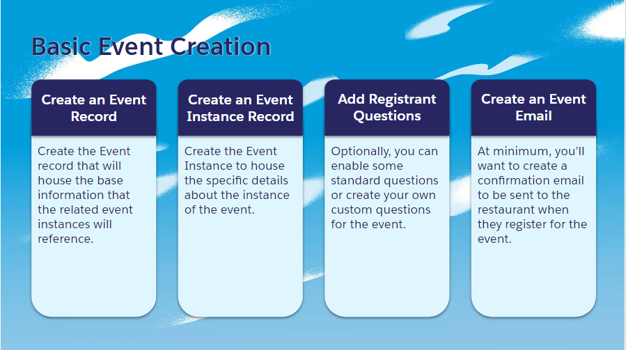
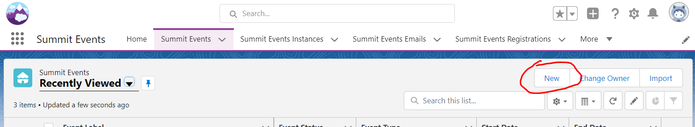
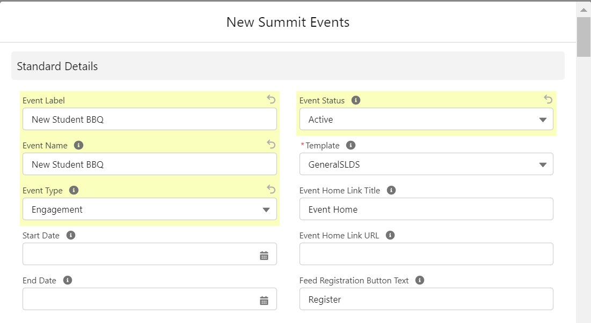
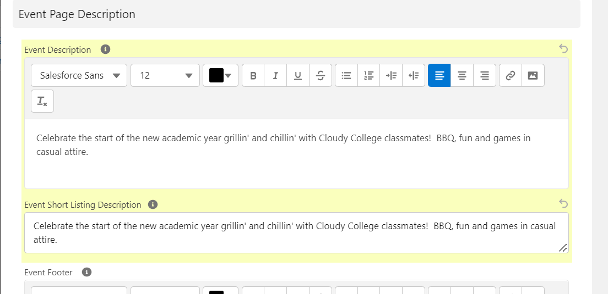
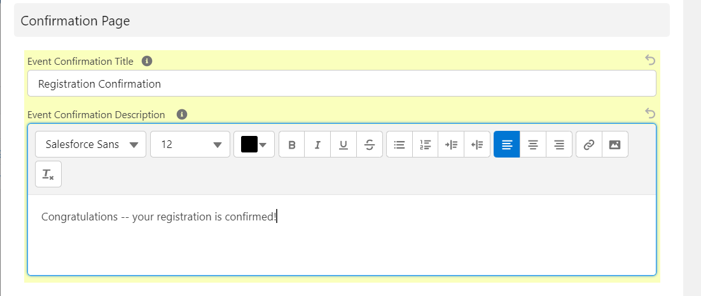
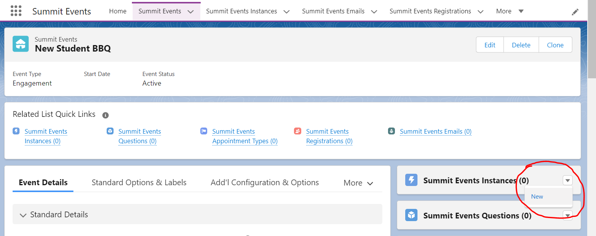
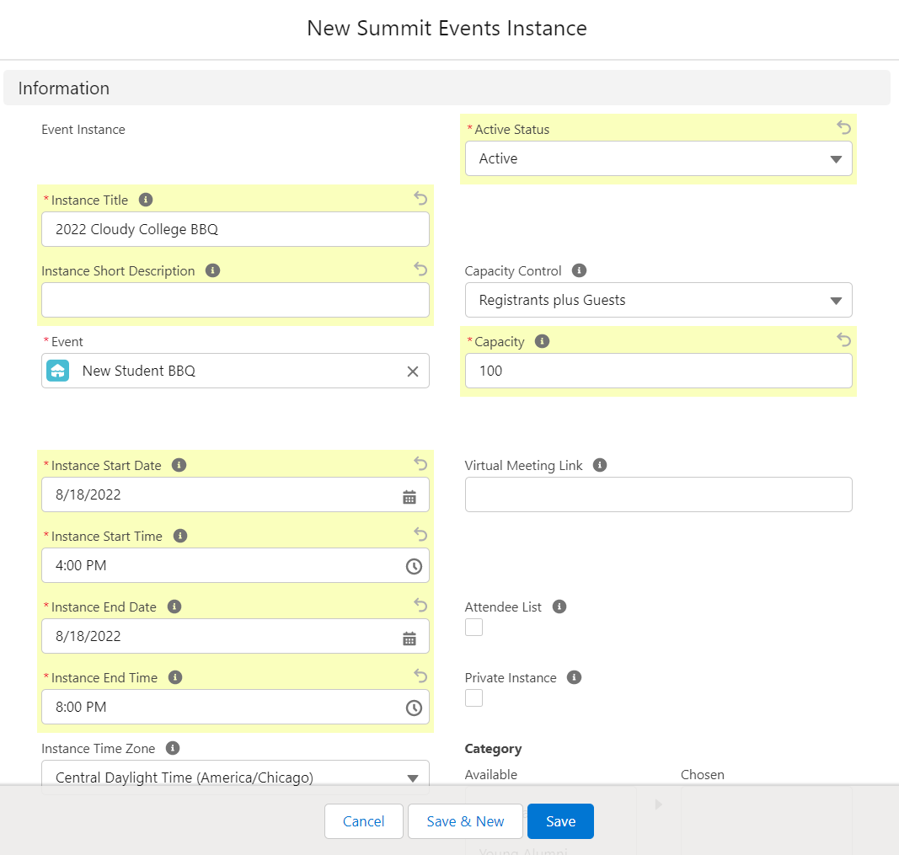
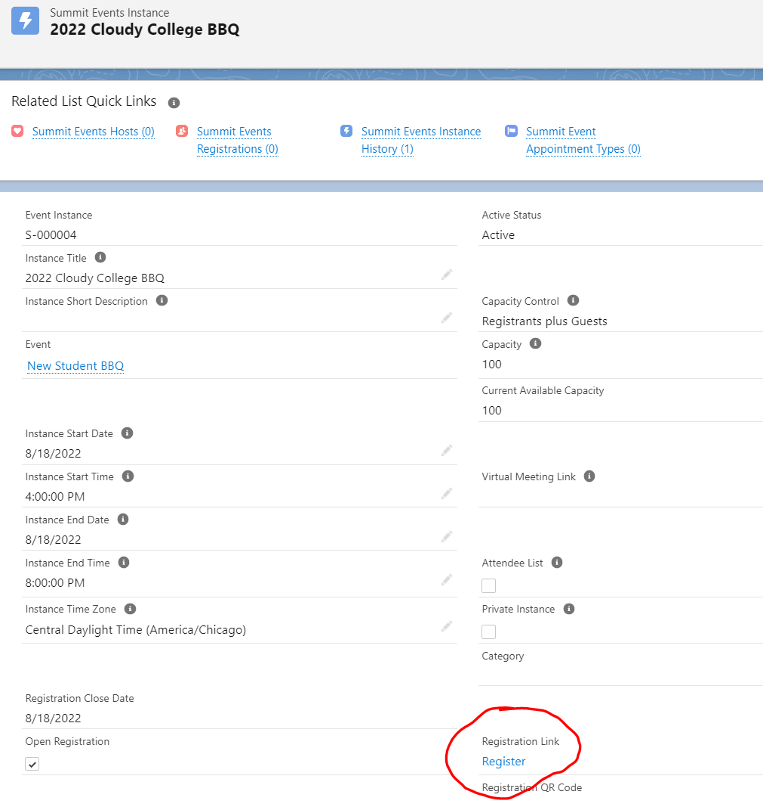
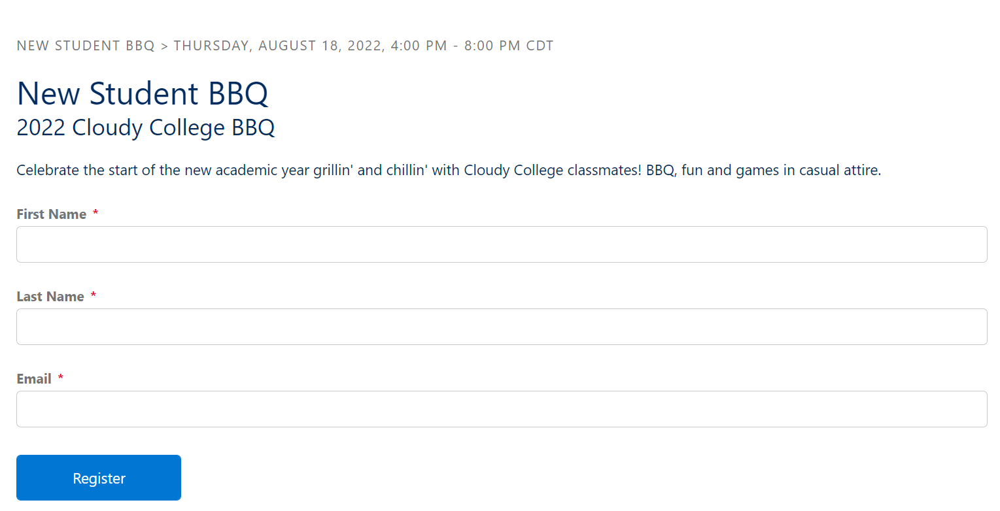

 

  
 
The first step in setting up a brand new event is to create a Summit Event record and an Event Instance record.  Summit Events are parent records to Summit Event Instance records.  You cannot have a summit event instance without it being tied to a parent summit event record.  Summit event instance records inherit much of the information from the parent Summit Event record.  This document covers the fields needed when creating a basic event.
 
 

# Creating a Basic Event

## Create the Event

Navigate to the Summit Events Application in the App Selector.

Navigate to the Summit Event tab and click on New.

Fill out the following fields on the Summit Event record.  Many of the fields listed below are not required but drive functionality and appear on the registration page.

| Object       | Field        | Section       | Purpose    |     
| :---         | :---         | :---          | :---       |
| Summit Event | Event Label  | Event Details | The Salesforce Record Name, should be populated otherwise will default to the record ID|
| Summit Event | Event Name   | Event Details | Name of the Event is the title on the registration page.|
| Summit Event| Event Status |Event Details | If the status on the Event is Active, it will show in the Community Base URL calendar.|
| Summit Event | Template | Event Details | Creates the page style |
| Summit Event | Event Description | Event Details | Used for a short description on the registration page.|
| Summit Event | Event Confirmation Title| Page Details | Title on the confirmation page after the registration was submitted. |
| Summit Event | Event Confirmation Description | Page Details | Additional details on the confirmation page.|

**Save** Summit Event record.

## Create the Related Event Instance
Navigate to the Summit Event Instance Related List on the Event record and create a New Summit Event Instance

 

Fill out the following fields on the Summit Event Instance record. Many of the fields listed below are not required but drive functionality and appear on the registration page.

| Object       | Field        | Purpose    |     
| :---         | :---         |  :---       |
| Summit Events Instance | Instance Title | Instance title appears under the Event Title on the Registration page |
| Summit Events Instance | Active Status | Instance needs to be “Active” for registration fields to be available. |
| Summit Events Instance | Event | Event to which this Instance is related. |
| Summit Events Instance | Capacity Control | Capacity field needs to be greater than 1 in order to see the registration fields and create a registration record.|
| Summit Events Instance | Instance Start Date | Needs to be in the future or possibly day of to register. |
| Summit Events Instance | Instance Start Time | Time Event is starting, appears on the registration page. |
| Summit Events Instance | Instance End Date | End Date appears on the registration page|
| Summit Events Instance | Instance End Time | End Time appears on the registration page.|

 

**Save** Summit Event Instance record.

## Review the Basic Event
On the newly created Event Instance record,  click the *Register* link under the Registration Link in the record heading.  

Navigate to the registration page and confirm registration fields are displaying and editable.  

**Congratulations, you've just created a basic event!**

## Additional Features
- To add questions to an event registration form, see [Standard Registration Questions](https://sfdo-community-sprints.github.io/summit-events-app-documentation/docs/standard-features/standard-reg-questions/).

- To generate a confirmation email for the event, see [Creating an Event Email](https://sfdo-community-sprints.github.io/summit-events-app-documentation/docs/standard-features/create-event-email/).
