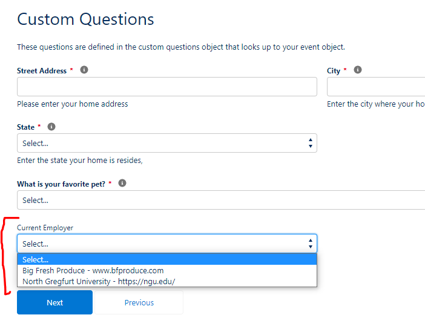

This page will detail more information related to the Lookup features of custom questions.

There are two types of ways to present fields to the registrant which will lookup to existing records in your Salesforce org.  Lookup and Lookup Picklist.  The difference in the two methods are how the records are displayed to the registrant. 

1. Lookup presents the field in the same way to the registrant as the lookup field is presented in Salesforce meaning the registrant would search for the record. 
2. Lookup Picklit presents the field as a drop-down of values from which they can select one option.

Lookup Object - object that contains the field with the data to be referenced
Lookup Fields - fields that you want to show when the registrant searches for an item.
Lookup Where Clause - using SOQL statement syntax, you can limit the records available for search in your lookup field. The API name of the field should be referenced. The WHERE clause follows field expression syntax. A fieldExpression is defined as follows: WHERE . Valid comparison operators include the following: =, !=, <, <=, >, >=, LIKE, IN, NOT IN, INCLUDES, and EXCLUDES.  
     [EXAMPLE SCREENSHOT]
    
Lookup Results Icon (optional) - Defaults to the standard account icon. Override the icon by entering the name of any standard icon found here https://www.lightningdesignsystem.com/icons/#standard
Lookup Secondary Value Field - This is required if using the Lookup Object feature. The API name for the field to land manual, registrant inputs when the registrant opts out of looking up a record.
Lookup Secondary Input Link Text - The link text that invites a user not to use the record lookup but rather fill in a value manually.
Lookup Secondary Input Question - If the lookup query is opted out of these instructions will appear below a blank text box for manual entry.

Lookup Example
[Sreenshot]

Lookup Picklist Example
Setup

Display

