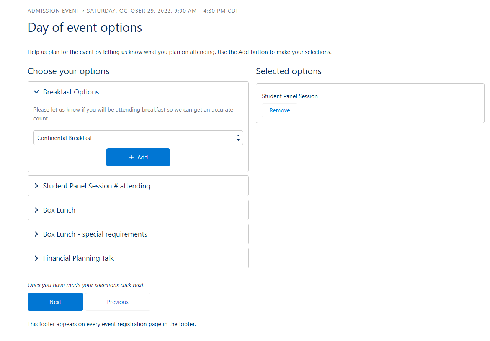
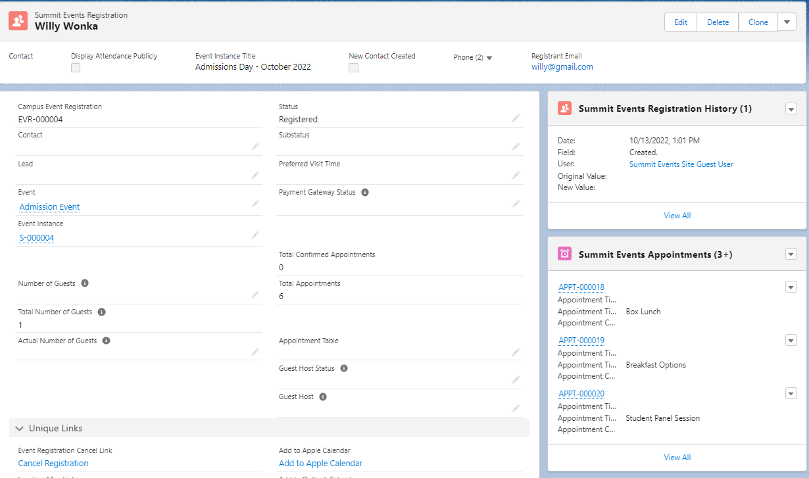

# Creating and Managing Event Appointments

There are scenarios where a registrant might need to select various options during the registration process.  This is where appointments come in handy.  Appointments are extremely flexible and can be used for a number of different purposes.  They also allow for time based options which is one way in which they differ from questions.   Appointments are configurable per event and used by event instances related to the event.  

Most events that utilize appointments will use these basic steps:
1. [Create an event with an event instance](https://sfdo-community-sprints.github.io/summit-events-app-documentation/docs/Getting-Started/create-basic-event/)
2. Configure the appointment option details
3. Create the appointment

Once the event and event instance have been created, you are able to configure the appointment page header and title using the Appointment Option Details section of the Event page.

## Configure the Appointment Option Details
When creating a new event or editing an existing event you'll use the Appointment Page Option section to configure the Event Appointment Title and Event Appointment Description.  These are the text above the appointments that gives the registrant context about what they are choosing.

## Create Appointments
Next you'll create the appointments for the registrant to choose.  Starting on the Summit Event page, locate the Appointment type related list and choose New.  Depending upon your page layout, the New option may appear as a button or in a drop-down on the related list.

Since the appointment is being created from the Event page, the Event field should default to the correct event.  If not, use the search feature to search for and select the correct event.  Give the appointment a Title.  This appears as the title of the appointment item.   The Appointment Type Status will default to Active.  Leave the default value.  Change the Sort Order to reflect the order in which the item should appear (optional).  Most of the time, you will use the Registrant Input field in the Appointment Options section to set up your appointment options as this gives the greatest flexibility.

In the Appointment Options section, set the following fields:
* Registrant Input - choose the type of information being collected for this appointment (custom picklist, custom picklist required, text, text required).
* Custom Picklist - if using custom picklist as the registrant input, add the picklist values for selection.  Multiple items should be entered with a hard return in between each.

Click Save to save the new appointment.  Repeat this process for each appointment needed.  

This is how the Appointments page appears during the registration process.  The Appointment Page Options appear above the Appointments on the registration screen and the appointments appear below on the left.  As the registrant expands the appointment and selects options, they appear on the right-side.

## Viewing a Registrant's Appointments

The registrant's appointments can be viewed on the Summit Events Appointments related list of the person's Summit Events Registration record.

On the registrant's appointment page, the item they selected appears in the Description field.  The appointment type name appears in the Appointment Title field.

