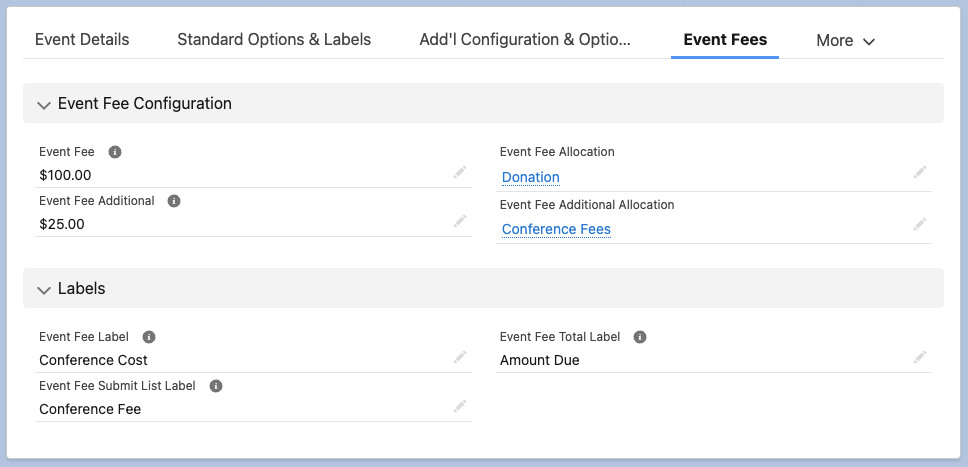
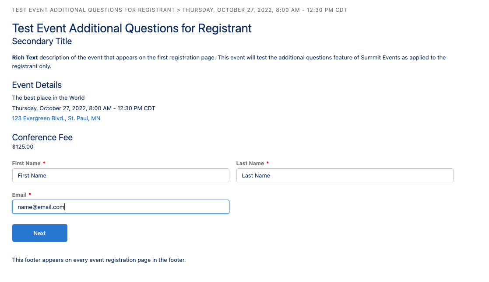
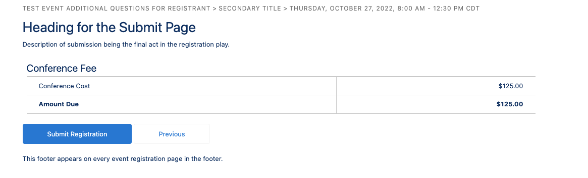

# Event Fees
Summit Events allows you to set event fees, where applicable.
Go to the Event Fees, Event Fee Configuration to set up an:
* Event Fee
* Event Fee Additional
* Event Fee Allocation
* Event Fee Additional Allocation

The Event Fee and Event Fee Additional fields allow you to set and can be useful for internal processing, if you need split fees for event cost and a donation, for example. Your registrants will see the full cost of the event on the first page of registration. See image below.

Event Fee Allocation and Additional Allocation allows your organization to designate where event fees should be allocated when fees are processed. This is an optional feature that can be left blank if not needed. See image above

Go to Labels, to set up:
* Event Fee Label - appears on the Submit Registration page
* Event Fee Submit List Label - appears on the first page of registration and the Submit Registration page - appears on the Submit Registration page
* Event Fee Total Label - appears on the Submit Registration page

