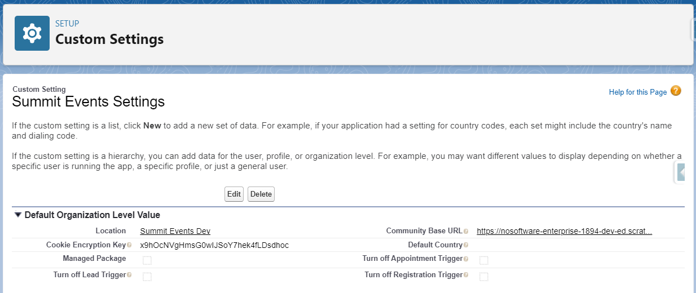
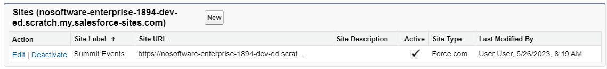

# Custom Settings

Custom Settings are where global attributes are stored that can be accessed by the programming in Summit Events App (SEA). This helps SEA have context for your particular installation. Many of these settings are required for SEA to work correctly.

How to get to SEA's custom settings:

1. Go to the Gear icon in your Salesforce org and select Setup.
2. In the Quick Find box type: Custom Setting.
3. Select the Custom Settings menu item.
4. Click the "Manage" link next to the label "Summit Events Settings".

You should see a view similar to this:

## Settings

### Location
This value will be prepoluated by Salesforce.

### Community Base URL
This is the default URL of a community SEA is installed. You must chose one default community URL from amongst your Community or Force.com sites in your org (Setup->Sites). SEA can be installed in any community by simply applying the right permission set to the guest user of a community, however some default context is needed for generating links to one community.

### Cookie Encryption Key
This key gets built upon install of SEA. It is unique to your org. You can adjust it, but it always must be the same amount of characters for it to work. This secret key decodes the encrypted cookie that gets generated for every registrant and is stored in their browsers. This cookie can be observed in the browser and will seem like garbage text. The Cookie Encryption key lives in custom settings and is used both to create that garbage text and decrypt it into a SEA event, instance and registration id on the server to keep the registrants context throughout the registration path.

### Default Country
Country picklists that appear in SEA can be default to a country of your choice by entering the exact country name in the Default Country setting. This setting is optional but is helpful if you want to default to a certain region and make it easier for locals to register.

### Managed Package:
If you installed the managed package version of SEA than this checkbox will be auto checked. Since SEA is Open-Source the code is maintained in such a way that anyone could deploy it to their site as unmanaged code. When SEA is deployed as unmanaged code this would not be checked. It is recommended that for enterprise user you always install SEA as a manage package for security confidence and some Salesforce.org limits increased.

### Trigger Settings
SEA comes packaged with some triggers. There may be times you wish to disable these triggers when troubleshooting issues in an org. SEA convienently makes that possible in Custom Settings. Checking the "Turn off" checkbox will stop the SEA trigger on the object affected.

### Turn off Appointment Trigger:
This trigger is used to auto generate itineraries when changes are made to the appointment record.

### Turn off Lead Trigger:
This trigger is used to enable Lead matching if set up for an event.

### Turn off Registration Trigger:
This trigger is used to do contact matching if set up for an event. It also is used to send out transactional emails if those have been created for an event.
