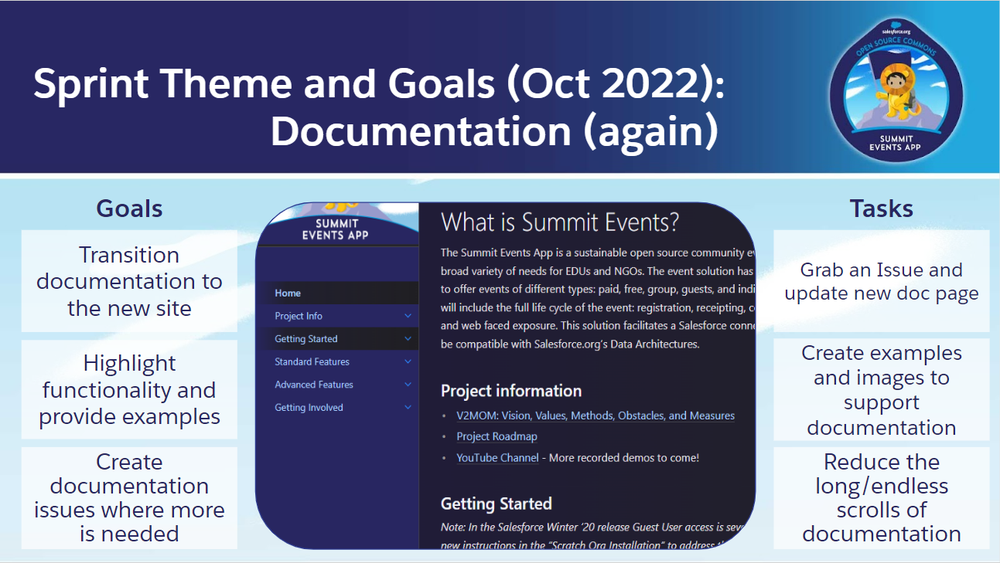

# October 2022 - Virtual Mini-Sprint
The Summit Events App Team, Community Volunteers and Users of the application came together for a 4-hour mini-sprint to tackle more of the documentation needs. Each Contributer listed below took an [issue](https://github.com/SFDO-Community-Sprints/summit-events-app-documentation/issues) and worked through getting "pencil on paper" to provide Summit Event Users an opporunity to understand the tools functionality and how to solve potential use cases.

A major THANK YOU to the contirubtors of the mini-sprint for their dedication and time to continuing to make Summit Events a meaningful community application.  We look forward to more contributing to the project and supporting the Salesforce.org community.

## Project Team
Thank you to the volunteers who contributed and engaged during this mini-sprint!
* Team Leader(s): Thad Dahlberg, Donna Whitig, Mike Walter, Ryan Blake
* GitHub Scribe(s): All Contributors below!
* List of all Contributors: 
  - [Thaddaeus Dahlberg](https://github.com/tcdahlberg)
  - [Mike Walter](https://github.com/walt0019)
  - [Donna Whitig](https://github.com/dwhitig)
  - [Ryan Blake](https://github.com/rdblake21)
  - [Tania Ortiz-Ashby](https://github.com/taniadoa)
  - [Sue Kolles](https://github.com/koll2427)
  - [Katie Gumpertz](https://github.com/ustkgh)
  

## Project Resources
* [Github Doc Resource Page](https://github.com/SFDO-Community-Sprints/summit-events-app-documentation)
* [Front-end User Documentation Site](https://sfdo-community-sprints.github.io/summit-events-app-documentation/)
* [Previous Github Wiki](https://github.com/SFDO-Community-Sprints/Summit-Events-App/wiki)
* [Issues Log](https://github.com/SFDO-Community-Sprints/summit-events-app-documentation/issues) 
* [Project Board](https://github.com/SFDO-Community-Sprints/summit-events-app-documentation/projects/1)

## Project Theme & Goals
* **Theme:** Documentation
* **Primary Goal:** Transition and Create site documentation highlighting functionality for an Users of Summit Events (not just Admins)
* **Tasks:** Assign Issues to contributors and get "pencil to paper"

## Project Team Accomplishments
* [Donations Overview](https://sfdo-community-sprints.github.io/summit-events-app-documentation/docs/advanced-features/capturing-payments/donations/) thanks to [Sue Kolles](https://github.com/koll2427)
* [Event Fees Overview](https://sfdo-community-sprints.github.io/summit-events-app-documentation/docs/advanced-features/capturing-payments/events-fees/) thanks to [Tania Ortiz-Ashby](https://github.com/taniadoa)
* [Cancelling Registrations](https://sfdo-community-sprints.github.io/summit-events-app-documentation/docs/standard-features/cancel-registrations/) thanks to [Katie Gumpertz](https://github.com/ustkgh)
* [Event Instance Functionality](https://sfdo-community-sprints.github.io/summit-events-app-documentation/docs/standard-features/event-instance-functionality/) thanks to [Ryan Blake](https://github.com/rdblake21)
* *Started* [Creating and Management Appointments/Options](https://sfdo-community-sprints.github.io/summit-events-app-documentation/docs/advanced-features/appointments-options/appointments-options/) thanks to [Donna Whitig](https://github.com/dwhitig)
* *Reviewed and Cleanup* [Contact and Lead Matching](https://sfdo-community-sprints.github.io/summit-events-app-documentation/docs/advanced-features/contact-and-lead-matching/) thanks to [Mike Walter](https://github.com/walt0019)
* *Started* drafting documentation on connecting Summit Events to a Payment Gateway thanks to [Thaddaeus Dahlberg](https://github.com/tcdahlberg)

## Future Contributions (AKA what was unable to be finish at the Mini-Sprint)
* Complete the *Started* and *In Progress* Issues
* Add images to pages that are all text (as appropriate)
* Continue to close open issues and complete the Summit Events current state documentation

## Team Needs:
* need-developers
* need-doc-writers
* need-qa-testers
* need-general-volunteers
* need-social-media-engagement
