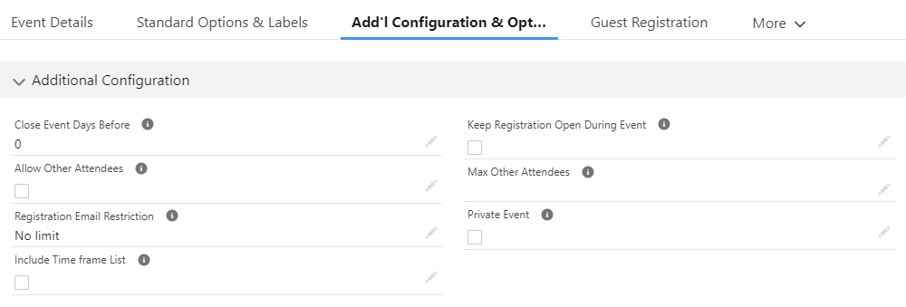
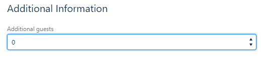

# Event Additional Configuration and Options

## Configuring Event Additional Options
Additional Configuration and Options offers additional functionality and expanded Registration Form options after the initial event is created. The event **Additional Configuration And Options**, depending upon when you initially installed Summit Events, will appear on the Add'l Configuration & Options tab of the Event page.

## Configuration Option Fields

| Option        | Field Type | Purpose/Behavior |
| :---          |:----| :---             |
| Close Event Days Before | Number | The amount of days before the event that you want the registration to close (e.g. accept no new registrations).  If this field is left blank, it will act as a zero and close the day of the Instance Start Date. |
| Allow Other Attendees | Checkbox | Used in conjunction with Max Other Attendees. When checked, it gives the primary registrant the opportunity to enter the number of additional guests coming with them.      Using this option, does not require any additional details about the other attendees. If additional details about the registrants guests are needed, the [guest registration process with custom questions](https://sfdo-community-sprints.github.io/summit-events-app-documentation/docs/advanced-features/custom-questions/#custom-questions-1) should be used. |
| Registration Email Restriction | Picklist | When an option is selected, registrants will have their email validated against the instance or event they are registering for. The validation will look for an existing email, ignoring “Canceled” or “Started” status registrations. If there is a match registrant, a message will be displayed to the registrant telling them there is an exsiting registration with that email and won'tbe able to register, preventing duplicate registrations.     **No limit** - no email restriction   **One registration per instance** - email must be unique per event instance   **One registration per event** - email must be unique between registrations across all instances associated to the event. |
| Include Timeframe List | Picklist | Controls whether the Preferred Visit Time displays on the registration page. The values are controlled on Preferred Visit Time field on the Summit Events Registration Object.  Default values are Morning, Afternoon, All Day    |
| Keep Registration Open During Event | Checkbox | When checked, the registration form is open and available during the duration of the event and will close based on the Instance End Time. |
| Max Other Attendees | Number | Works in conjunction with the Allow Other Attendees option.  When Allow Other Attendees is enabled, this field provides the registrant with a picklist reflecting options up to the max number entered. |
| Private Event | Checkbox | When selected, the event is considered private and the related instances will not appear on the calendar of events or in the event feed. There is a similar field on the instance record should only a single instance be considered private. |

