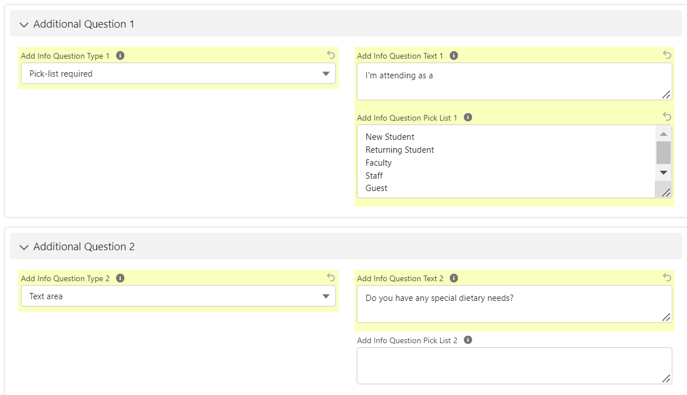
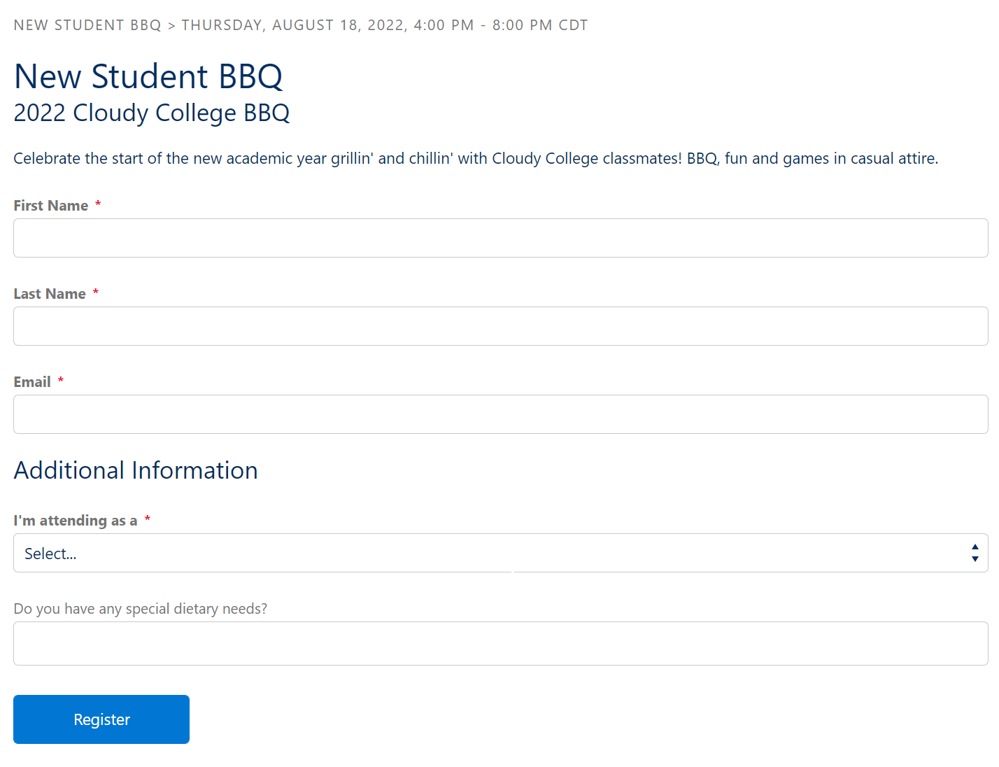

## Registrant Additional Questions
Standard questions are predefined questions that can be enabled to show during the registration process.  These fields have specific preconfigured field types (e.g. text, picklist, etc.). The standard questions are configured on the Summit Events event pages. You can select which ones you want to display, if the field should be required, you can even change the label of the question. These may be all that is needed for most of your events. If you have more advanced needs, Summit Events also provides the ability to create your own [custom questions](https://sfdo-community-sprints.github.io/summit-events-app-documentation/docs/advanced-features/custom-questions/).

The “Additional Configuration” section can be used to define up to 5 additional questions for appearance on your registration page.  For each question, you select the type of question from a predefined list of options.  

Choosing a Type from the “Add Info Question Type” field, enables the field to display on the registration form.   The “Add Info Question Text” is used to control the label/text that displays with the question.  If the Type of the question chosen is picklist, the “Add Info Question Pick List” is used to specify the values to present as choices.  Additional Questions appear below standard questions on the registration form.

 

# Create an Additional Question

1. From the Summit Event record, navigate to the Add’l Configuration & Options section.  
2. In the Additional Question 1 section, select the appropriate Type from the list of options in ”Add Info Question Type 1” field.
The available type options are:

| Option    | Behavior |
| :---      | :---         |
| Pick-list | optional for the registrant, a list of predefined options |
| Pick-list required | required for the registrant, a list of predefined options |
| Text area | optional for the registrant, free multi-line text textbox area of up to 255 characters |
| Text area required | required for the registrant, free multi-line text textbox area of up to 255 characters |
| Text box | optional for the registrant, free single line text textbox of up to 255 characters |
| Text box required | required for the registrant, free single line text textbox of up to 255 characters |

3. Enter the prompt text to appear with the question in the “Add Info Question Text”field. 
4. If the Type of the question chosen is picklist, add the options in the “Add Info Question Pick List” field.  Multiple items are entered with a hard return in between each.  The items will only appear if you have selected Pick-list or Pick-list required as the question type.
5. Repeat for questions 2-5, if necessary. If you need more than five questions proceed to the custom questions section.

6. On Event Instance record,  click the *Register* link under the Registration Link in the record heading.  

9. Navigate to the registration page and confirm registration fields are displaying and editable.  

