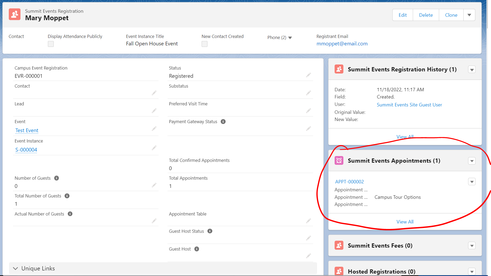

---
title: Assinging Hosts
parent: Creating a Host
grand_parent: Standard Features
--- 

# Assigning Hosts

Event Hosts work in conjunction with registrant's appointment records to allow event managers to assign hosts to appointments.  This can be help the event manager understand how many people are assgined to each campus tour guide or how many individuals are assigned to a table.  

## Assigning a Host to a Registrant's Appointment Record

1. Locate the Summit Event Appointments related list in the individual's registration.  This could be located at the bottom of the page, on the registrations related tab or on the side of the registration record depending upon your page layout. 
 
2. Choose the appointment to which you want to relate the host by clicking the value/hyperlink of the Event Appointments Name field. You will be directed to the Summit Event Appointment page.   

3. Edit the registrant's Summit Event Appointment page and use the lookup to select the desired Host.   
*Tip: The host lookup feild, returns hosts regardless of instance.  To make it easier to find the correct host, you can [create a calculated field on the Host object](https://sfdo-community-sprints.github.io/summit-events-app-documentation/docs/standard-features/create-a-host/Host_object_Calc_Field/) to display more information in the lookup field.*

4. Save the record.

 
See [Create an Event Host](https://github.com/SFDO-Community-Sprints/summit-events-app-documentation/blob/main/docs/standard-features/SE_Hosts_Feature/Creating-an-event-host.md) for information on setting up an Event Host.
 
 

## TROUBLESHOOTING ##

When hosts are assigned to appointments, the max available field on the host record is decremented.  If the value of the Remaining field of the event host is larger than 0, the Host List should show records of the available hostings for you to choose.  If the value of the Remaining field is 0 or below, the host will not show up for selection in the Lookup field.

 
