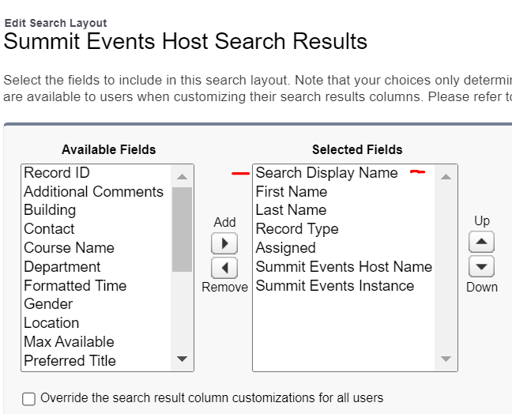
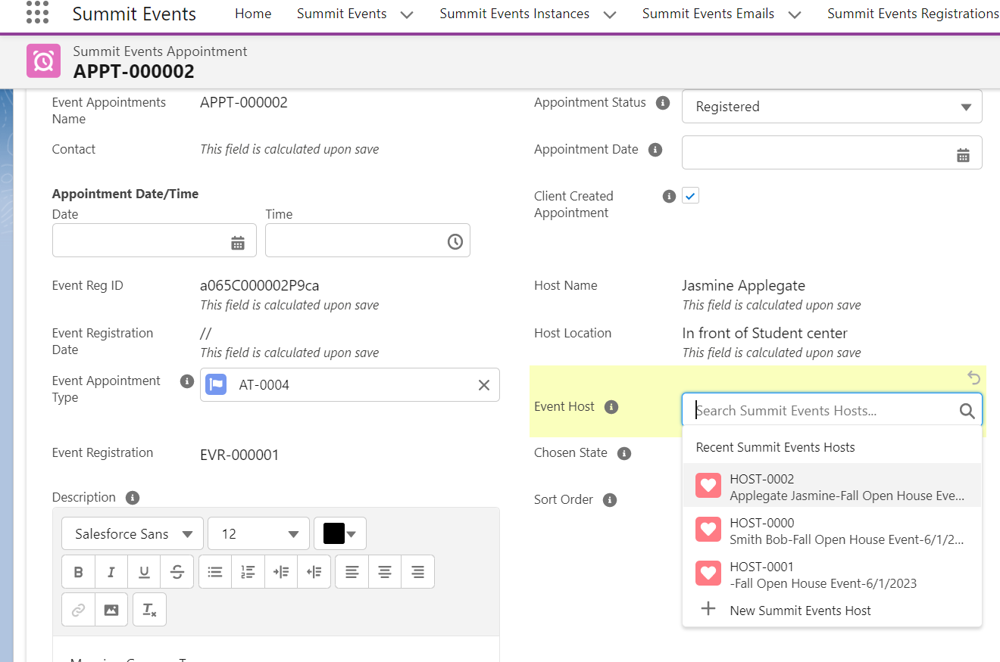

---
title: Calculated Fields on Host Object
parent: Creating a Host
grandparent: Standard Features
--- 

# Create Calculated Field on Host Object #

1. From Setup, open the Object Manager and search for the Summit Events Host object.
2. In the left sidebar, click Fields & Relationships.
3. Click New.
4. Select Formula and click Next.
5. In Field Label, give the field a name.  For example: Search Display Name. When you click out of the field label, the API name will automatically be created for you.
6. Select the Text as the type of data you expect your formula to return.
7. Click Next. You’ve arrived at the formula editor!
8. Click on the Advanced tab and Use the The Insert Field button to open a menu that allows you to select fields to use in your formula. Inserting from this menu automatically generates the correct syntax for accessing fields. The feilds you include here will depend upon how you are using Hosts.

Example calculation to display the host first and last name feilds along with the event instance name and date:  
Contact__r.LastName + ' '+ Contact__r.FirstName + '-'+   Event_Instance__r.Instance_Title__c  +'-'+ TEXT(MONTH(Event_Instance__r.Instance_Start_Date__c)) + '/'+
TEXT(DAY(Event_Instance__r.Instance_Start_Date__c))+'/'+
TEXT(YEAR(Event_Instance__r.Instance_Start_Date__c))

 

## Add the Calculated Field to the Search Layout ##
Once you have your formula field created, you can add it as the first item in your Search Layouts screen.
1. From Setup, open the Object Manager and search for the Summit Events Host object.
2. In the left sidebar, click on Search Layouts. 
3. Click on the drop-down to the left of the Default Layout and choose Edit.
4. Move your new formula field from the Available Fields side to the Selected Field side.  Use the up and down arrows to make sure it is the first field listed.  When finished, save the layout.
 
 

When searching for the Host on the registrant's appointment record, you will now see the additional field.

For more information see: [Formula Creation Trailhead](https://trailhead.salesforce.com/content/learn/modules/point_click_business_logic/formula_fields)
