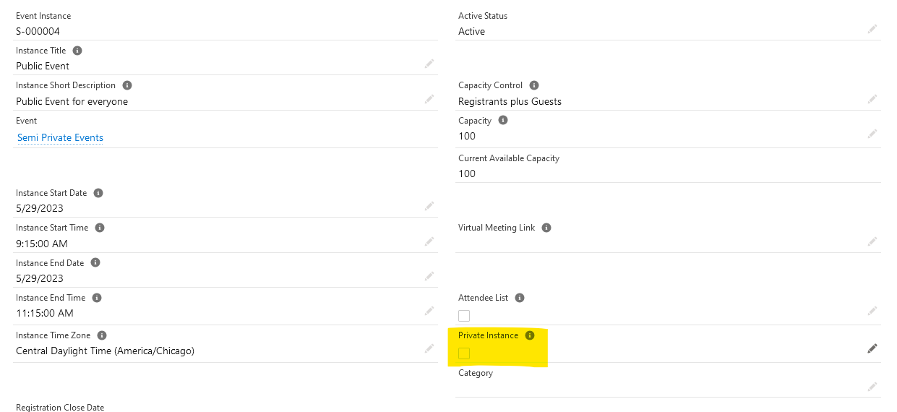
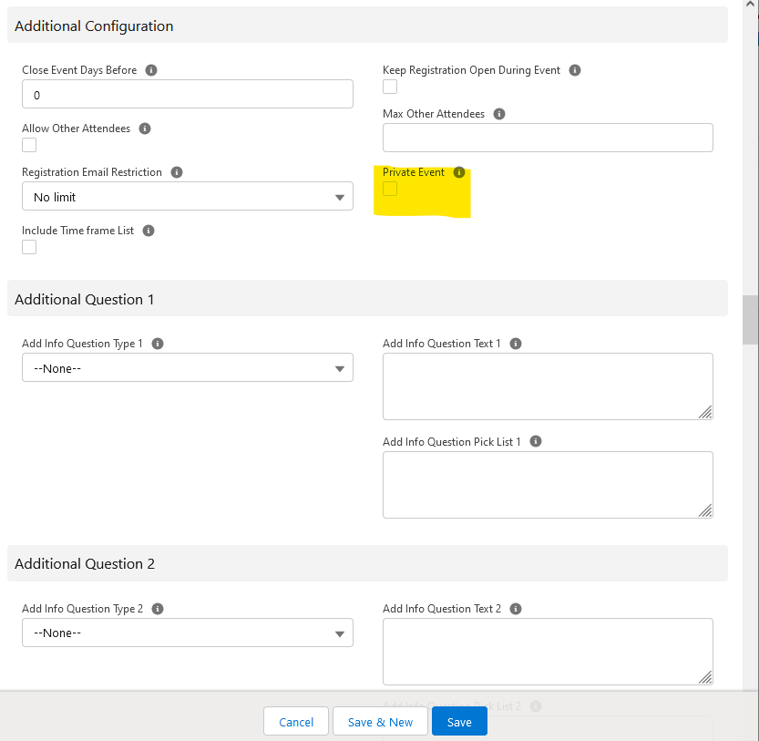

*This page is still needing some content. If you're interested in contributing to the Summit Events App and want to help provide support by creating this page, comment below and let us know!*

# Private Events Overview

**The Private Event feature blocks the event instance from appearing on event lists/calendars. You have two options when using the feature:**

**If some event instances will be private, toggle the Private checkbox at the Event Instance level as shown in the following screen shot:**

**If all the event instances will be private, mark the Private checkbox at the Additonal Configuration section in the Event page as shown in the following screen shot:**

  

